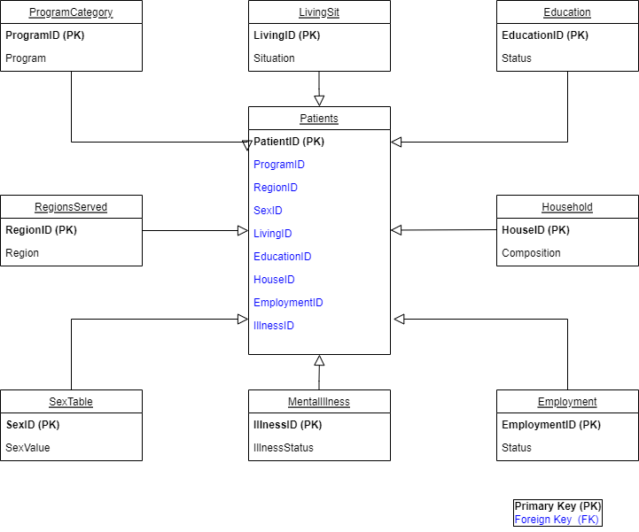

# Healthcare-Analytics

## Research
Conduct analysis on the hospital data and better understand relation of 
various factors in a patient condition . Visualization and inferences from data help in understanding 
characteristics of diseases. Our purpose revolves around understanding the condition of any patient 
by considering his state features and his disease characteristics

The above Entity Relationship diagram explains the research data schema healthcare data by analyzing various components

## Future Scope
Scope of this project will be to include prediction model with the data analysis part, so 
that the project could predict the condition of any patient given his disease characteristics or 
disease conditions
